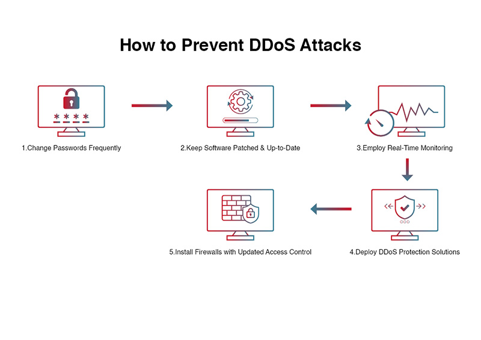

# 🛠️ Incident Report

## 📝 Issue Summary

The issue took **4 hours** to resolve. The problem was caused by a Distributed Denial of Service (DDoS) attack, where someone sent too many requests to the server, causing it to go down. 💀

## 🕒 Timeline

- **9:00 AM - 1:15 PM:** Incident duration.
- **9:00 AM - 10:15 AM:** Verified the servers (Apache and DNS). Sent several HTTP requests to the server, but no response was received, leading to the identification of a DDoS attack. 🚨
- **10:30 AM - 11:00 AM:** Restarted the server, which came back online. Decided to add a firewall for additional protection. 🔒
- **11:00 AM - 1:15 PM:** Installed the firewall on the two servers. After testing the setup with an attack simulation, the server went down again. Realized that the firewall was not configured on the load balancer. ⚠️

## 🔍 Root Cause and Resolution

The root cause was a DDoS attack that overwhelmed our server. The website, still under development, was not fully prepared for such an attack. More time was needed for thorough testing. ⏳

Due to the sensitivity of our data, this type of attack could potentially destroy it. To prevent future incidents, we are working on creating backups on a local server. 🗄️
